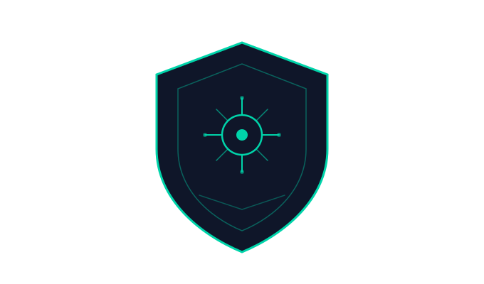
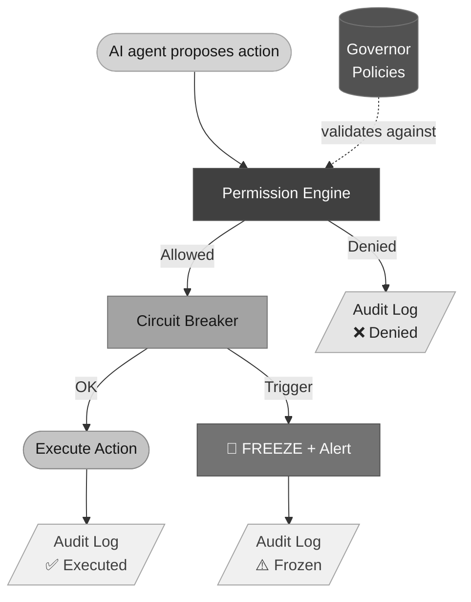

<p align="center">
  
</p>

<h1 align="center">Sentinel Protocol</h1>

<p align="center">
  <strong>The governance standard for autonomous AI agents on Solana.</strong>
</p>

<p align="center">
  <a href="https://www.apache.org/licenses/LICENSE-2.0"></a>
  <a href="https://solana.com"></a>
  <a href="https://www.anchor-lang.com/"></a>
  <a href="https://x.com/sln_sentinel_ai"></a>
</p>

---

Sentinel Protocol defines how AI agents are controlled, limited, and audited on-chain. Think of it as the **Metaplex of agent governance**: an open, composable standard that any framework can plug into.

AI agents on Solana already manage treasuries, execute trades, and coordinate through DAOs. The ecosystem has identity (Agent Registry, SAID Protocol) and execution (ElizaOS, GOAT, ZerePy), but nobody standardizes what an agent is _allowed_ to do. Sentinel fills that gap with on-chain permissions, spending limits, circuit breakers, and an immutable audit trail.

## How it works

An agent wants to swap 500 USDC on Jupiter. Before the transaction hits the chain, Sentinel intercepts it:



The Governor holds the rules. The Permission Engine enforces them. The Circuit Breaker catches anomalies. The Audit Log records everything. All on-chain, all verifiable.

## Core components

Sentinel is four Anchor programs and one SDK:

**Governor Registry** — Each governed agent gets a Governor: a PDA that stores its spending policies, allowed protocols, token allowlists, circuit breaker config, multisig settings, and timelock delays. The Governor is the single source of truth for what the agent can and cannot do.

**Permission Engine** — On-chain middleware that validates every agent action against its Governor. Supports individual validation, batch validation for efficiency, and a request/approve flow for actions that need multisig sign-off.

**Circuit Breaker** — Automatic kill-switch. Configurable thresholds for max loss percentage, transaction rate limits, per-transaction caps, and anomaly detection windows. When triggered, the agent freezes and the authority gets notified. Optionally resumes after a cooldown period.

**Audit Log** — Immutable record of every action: what the agent tried to do, whether it was allowed or denied, and the transaction signature. Detailed logs go to Arweave/Shadow Drive with a verification hash on-chain to keep costs low.

**sentinel-sdk** — TypeScript and Python libraries that wrap the on-chain programs. Plugins for ElizaOS, GOAT Framework, and ZerePy let developers add governance in a few lines of code.

## Quick start

### Prerequisites

- [Rust](https://rustup.rs/) (latest stable)
- [Solana CLI](https://docs.solanalabs.com/cli/install) (v1.18+)
- [Anchor](https://www.anchor-lang.com/docs/installation) (v0.30+)
- [Node.js](https://nodejs.org/) (v18+)

### Build and test

```bash
# Clone the repo
git clone https://github.com/sentinel-protocol/sentinel-protocol.git
cd sentinel-protocol

# Install dependencies
yarn install

# Build all programs
anchor build

# Run tests
anchor test

# Deploy to devnet
solana config set --url devnet
anchor deploy
```

### Govern your first agent

```typescript
import { SentinelGovernor } from "sentinel-sdk";

const governor = new SentinelGovernor({
  agent: myAgent.publicKey,
  spendingLimit: { perDay: 100, token: "USDC" },
  allowedProtocols: ["jupiter", "raydium"],
  circuitBreaker: { maxLossPercent: 5 },
  multisig: { threshold: 2, signers: [alice, bob, carol] },
});

await governor.deploy(); // Creates the Governor PDA on-chain
```

That's it. The agent is now governed. Any action that violates these policies gets blocked before execution.

### Validate an action

```typescript
import { PermissionValidator } from "sentinel-sdk";

const validator = new PermissionValidator(governor);

const result = await validator.check({
  actionType: "Swap",
  targetProgram: JUPITER_PROGRAM_ID,
  amount: 50_000_000, // 50 USDC (6 decimals)
  token: USDC_MINT,
});

if (result.allowed) {
  // proceed with the swap
} else {
  console.log(`Blocked: ${result.reason}`);
}
```

### Emergency stop

```typescript
import { CircuitBreaker } from "sentinel-sdk";

const breaker = new CircuitBreaker(governor);

// Manual freeze
await breaker.triggerEmergencyStop("Suspicious withdrawal pattern detected");

// Resume after investigation
await breaker.resume();
```

## Framework integrations

Sentinel ships plugins for the three major Solana agent frameworks. Each plugin wraps the framework's execution layer so governance happens automatically, with no changes to agent logic.

### ElizaOS

```typescript
import { SentinelPlugin } from "sentinel-sdk/plugins/elizaos";

// Wraps all on-chain actions with Sentinel validation
const plugin = new SentinelPlugin({
  governorAddress: "your-governor-pda",
});

// Add to your ElizaOS agent config
agent.registerPlugin(plugin);
```

### GOAT Framework

```typescript
import { sentinelMiddleware } from "sentinel-sdk/plugins/goat";

// Intercepts GOAT tool calls before execution
agent.use(sentinelMiddleware({ governor: "your-governor-pda" }));
```

### ZerePy (Python)

```python
from sentinel_sdk.plugins.zerepy import SentinelGuard

guard = SentinelGuard(governor="your-governor-pda")

# Wraps agent actions with on-chain validation
agent.add_guard(guard)
```

## Architecture

```
sentinel-protocol/
├── programs/                    # Anchor programs (Rust)
│   ├── governor-registry/       # Governor PDA management
│   ├── permission-engine/       # Action validation logic
│   ├── circuit-breaker/         # Emergency stop system
│   └── audit-log/               # Immutable action logging
├── sdk/                         # TypeScript SDK + framework plugins
├── python-sdk/                  # Python SDK for ZerePy
├── app/                         # Governance dashboard (Next.js)
├── cli/                         # CLI tool for governor management
├── tests/                       # Integration + stress tests
├── docs/                        # Architecture docs + integration guides
└── examples/                    # Working examples
    ├── basic-governor/
    ├── trading-bot/
    ├── dao-governed-agent/
    └── x402-payments/
```

## Ecosystem compatibility

Sentinel is designed to complement existing infrastructure, not replace it:

| Protocol                  | Relationship                                                                                                       |
| ------------------------- | ------------------------------------------------------------------------------------------------------------------ |
| **Solana Agent Registry** | Sentinel reads agent identity from the registry. The Governor references the agent's registry ID.                  |
| **SAID Protocol**         | Agent reputation scores can feed into Sentinel policies (e.g., agents with score > 80 get higher spending limits). |
| **x402 Protocol**         | Sentinel validates x402 payment actions against spending policies.                                                 |
| **Squads Protocol**       | Advanced multisig support via Squads integration for governor management.                                          |

## Roadmap

**Q2 2026** — MVP on Devnet. Governor Registry, Permission Engine, Circuit Breaker, Audit Log, TypeScript SDK alpha. Hackathon submission.

**Q3 2026** — Ecosystem integration. ElizaOS, GOAT, and ZerePy plugins published on npm/PyPI. Governance dashboard. Security audit.

**Q4 2026** — Mainnet beta. 100+ governed agents. Developer grant program. Listed on awesome-solana-ai.

**Q1 2027** — Token launch. Validator network for behavior auditing. Insurance pools v1. DAO governance for the protocol itself.

## Contributing

We welcome contributions of all kinds. Check out [CONTRIBUTING.md](CONTRIBUTING.md) for guidelines.

A few places where help is especially useful:

- **New framework plugins** — Integrate Sentinel with agent frameworks beyond ElizaOS/GOAT/ZerePy
- **Policy templates** — Pre-built governor configurations for common use cases (trading bots, payment agents, DAO operators)
- **Testing** — Edge cases, stress tests, fuzzing the on-chain programs
- **Documentation** — Integration guides, tutorials, translations

### Development setup

```bash
# Fork and clone
git clone https://github.com/your-username/sentinel-protocol.git
cd sentinel-protocol

# Install deps
yarn install

# Start local validator
solana-test-validator

# Build + test
anchor build
anchor test

# Run specific test suites
anchor test -- --grep "governor-registry"
anchor test -- --grep "circuit-breaker"
anchor test -- --grep "full-flow"
```

## Security

Sentinel is pre-audit software. Do not use in production with real funds until a formal security audit has been completed.

If you find a vulnerability, please report it privately to [sol-sentinel-protocol@proton.me](mailto:sol-sentinel-protocol@proton.me). Do not open a public issue. We will acknowledge receipt within 48 hours and aim to publish a fix within 7 days for critical issues.

## Pitch Deck

Choose your language:

- **[English 🇬🇧](https://docs.google.com/presentation/d/1YTMJlaVirLHUFTg61EvdOotBp80UVgsClunzXGO8zO0/edit?usp=sharing)**
- **[Português 🇧🇷](https://docs.google.com/presentation/d/1wWexZFpSrlSLVohQmJXl86nkVzFER8kpdtNuNpc86c8/edit?usp=sharing)**
  

## License

Apache 2.0. See [LICENSE](LICENSE) for the full text.

## Links

- **X/Twitter**: [@sln_sentinel_ai](https://x.com/sln_sentinel_ai)
- **Email**: [sol-sentinel-protocol@proton.me](mailto:sol-sentinel-protocol@proton.me)
- **Solana Agent Registry**: [solana.com/agent-registry](https://solana.com/agent-registry)
- **Anchor Framework**: [anchor-lang.com](https://www.anchor-lang.com/)

---

<p align="center">
  <em>Governing the future of the agentic economy.</em>
</p>
