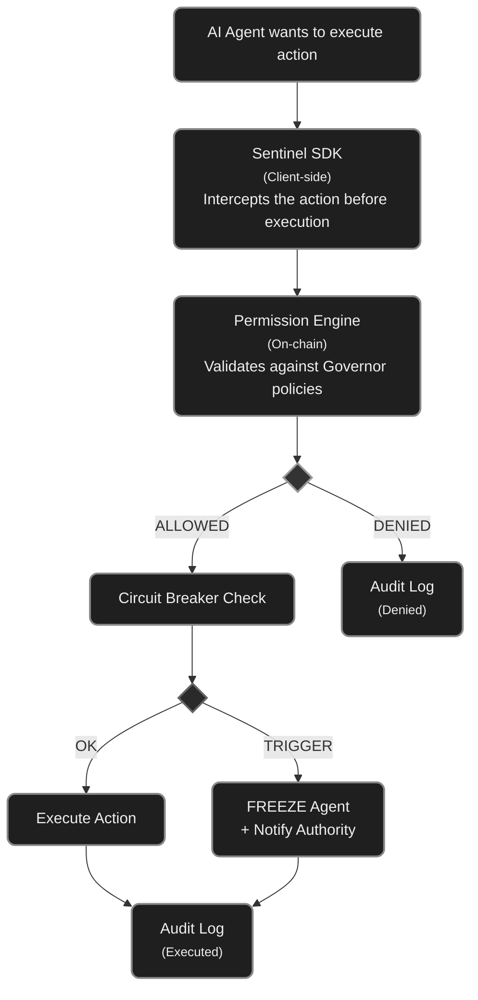
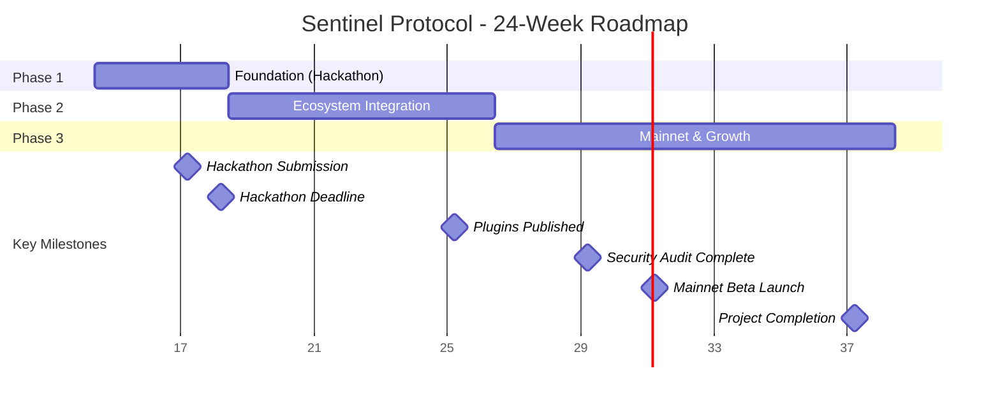

# Sentinel Protocol — Plano de Implementação

## Visão Geral

O Sentinel Protocol é um protocolo open-source de governança para agentes autônomos de IA na Solana. Ele padroniza como agentes são controlados, limitados e auditados on-chain — funcionando como o "Metaplex da governança de agentes".

Este documento detalha a arquitetura técnica, fases de desenvolvimento, stack tecnológico e milestones para levar o projeto do conceito ao mainnet.

---

## 1. Arquitetura Técnica

### 1.1 Componentes Core do Protocolo

O protocolo é composto por 4 programas Anchor on-chain e 1 SDK off-chain:

**Programa 1: Governor Registry**
Registro central de "Governors" — cada Governor é uma conta PDA (Program Derived Address) que define as regras de governança de um agente específico. Quando um desenvolvedor quer governar um agente, ele cria um Governor vinculado à public key do agente.

Campos da conta Governor:
- `authority` (Pubkey): quem pode modificar as regras (owner, multisig ou DAO)
- `agent` (Pubkey): a public key do agente governado
- `spending_policy` (SpendingPolicy): limites de gasto
- `allowed_protocols` (Vec<Pubkey>): program IDs que o agente pode interagir
- `allowed_tokens` (Vec<Pubkey>): token mints permitidos
- `circuit_breaker` (CircuitBreakerConfig): condições de parada emergencial
- `multisig_config` (Option<MultisigConfig>): configuração de multi-assinatura
- `timelock_seconds` (u64): delay obrigatório para mudanças de policy
- `status` (GovernorStatus): Active, Paused, Frozen, Decommissioned
- `created_at` (i64): timestamp de criação
- `updated_at` (i64): timestamp da última atualização

**Programa 2: Permission Engine**
Motor de permissões que intercepta e valida ações do agente contra as policies definidas no Governor. Funciona como um middleware on-chain.

Instruções principais:
- `validate_action(agent, action_type, target_program, amount, token)` → retorna Allow/Deny
- `request_permission(agent, action_descriptor)` → para ações que requerem aprovação
- `approve_permission(signer, request_id)` → aprovação de multisig
- `batch_validate(agent, actions[])` → validação em lote para eficiência

**Programa 3: Circuit Breaker**
Sistema de parada emergencial automática.

Parâmetros configuráveis:
- `max_loss_percent` (u8): perda máxima permitida antes do freeze (ex: 5%)
- `max_transactions_per_hour` (u32): rate limit de transações
- `max_single_transaction_amount` (u64): teto por transação individual
- `anomaly_detection_window` (u64): janela de tempo para detectar padrões anômalos
- `cooldown_period` (u64): tempo de cooldown após trigger
- `auto_resume` (bool): se o agente volta automaticamente após cooldown

Instruções:
- `check_and_enforce(agent, proposed_action)` → verifica contra limites
- `trigger_emergency_stop(agent, reason)` → para manual por authority
- `resume_agent(agent)` → retoma operação (requer authority ou cooldown)

**Programa 4: Audit Log**
Registro imutável on-chain de todas as ações do agente.

Cada entrada de log contém:
- `agent` (Pubkey)
- `action_type` (enum: Transfer, Swap, Stake, GovernanceChange, etc.)
- `target_program` (Pubkey)
- `amount` (u64)
- `token` (Pubkey)
- `result` (enum: Allowed, Denied, CircuitBreakerTriggered)
- `timestamp` (i64)
- `tx_signature` (Hash)

Nota: para otimizar custos on-chain, logs detalhados são armazenados off-chain (Arweave/Shadow Drive) com hash de verificação on-chain.

**SDK TypeScript/Python: sentinel-sdk**
Biblioteca client-side que abstrai a complexidade dos programas on-chain.

```
sentinel-sdk/
├── src/
│   ├── governor.ts          # Criação e gerenciamento de Governors
│   ├── permissions.ts       # Validação de permissões
│   ├── circuit-breaker.ts   # Configuração de circuit breakers
│   ├── audit.ts             # Consulta de logs de auditoria
│   ├── multisig.ts          # Operações multi-assinatura
│   ├── plugins/
│   │   ├── elizaos.ts       # Plugin para ElizaOS
│   │   ├── goat.ts          # Plugin para GOAT Framework
│   │   └── zerepy.ts        # Plugin para ZerePy
│   └── utils/
│       ├── pda.ts           # Helpers para PDAs
│       └── types.ts         # Tipos compartilhados
├── python/
│   └── sentinel_sdk/        # Bindings Python para ZerePy
└── examples/
    ├── basic-governor.ts
    ├── trading-bot-governance.ts
    └── dao-governed-agent.ts
```

### 1.2 Diagrama de Fluxo




### 1.3 Integração com o Ecossistema Existente

- **Agent Registry (Solana Foundation):** Sentinel lê a identidade do agente do Agent Registry. O Governor referencia o agent_id do registry, não reinventa identidade.
- **SAID Protocol:** Sentinel pode usar SAID scores como input para policies (ex: agentes com reputação > 80 têm limites maiores).
- **ElizaOS:** Plugin que wrappa o `execute()` do ElizaOS com validação Sentinel antes de cada ação on-chain.
- **GOAT Framework:** Middleware que intercepta tool calls do GOAT e valida contra o Governor.
- **x402 Protocol:** Validação de pagamentos x402 contra spending policies.

---

## 2. Stack Tecnológico

### 2.1 On-chain (Solana Programs)

| Componente | Tecnologia | Justificativa |
|---|---|---|
| Smart Contracts | Anchor (Rust) | Framework padrão Solana, type-safety, IDL automática |
| Testes | Anchor Test (Mocha/TypeScript) | Testes de integração end-to-end |
| Deployment | Solana CLI + Anchor Deploy | Devnet → Mainnet pipeline |
| Armazenamento off-chain | Shadow Drive ou Arweave | Logs detalhados com hash on-chain |

### 2.2 SDK & Tooling

| Componente | Tecnologia | Justificativa |
|---|---|---|
| SDK Principal | TypeScript | Ecossistema Solana é TS-first |
| SDK Python | Python bindings (anchorpy) | Para ZerePy e agentes Python |
| CLI | Node.js (Commander.js) | Gerenciamento de governors via terminal |
| Dashboard | React + Next.js | Interface web para monitoramento |

### 2.3 Infraestrutura

| Componente | Tecnologia | Justificativa |
|---|---|---|
| CI/CD | GitHub Actions | Deploy automático, testes |
| Monitoramento | Helius Webhooks | Alertas em tempo real de ações |
| Indexação | Helius DAS API | Consulta rápida de logs e estados |
| Documentação | Docusaurus | Docs developer-friendly |

---

## 3. Fases de Desenvolvimento

### FASE 1: Foundation (Semanas 1-4) — Para o Hackathon

**Objetivo:** MVP funcional no Devnet demonstrando o core do protocolo.

**Semana 1: Setup & Governor Registry**
- Inicializar projeto Anchor com estrutura monorepo
- Implementar programa Governor Registry (criar, atualizar, pausar governors)
- Definir structs de dados (SpendingPolicy, CircuitBreakerConfig, MultisigConfig)
- Testes unitários para todas as instruções
- Deliverable: Governor pode ser criado e configurado no Devnet

**Semana 2: Permission Engine & Circuit Breaker**
- Implementar programa Permission Engine (validate_action, request/approve_permission)
- Implementar programa Circuit Breaker (check_and_enforce, emergency_stop)
- Cross-program invocations (CPI) entre Permission Engine ↔ Governor ↔ Circuit Breaker
- Testes de integração: agente tenta ação → permitida/bloqueada
- Deliverable: Flow completo de validação funcionando

**Semana 3: SDK TypeScript Alpha + Audit Log**
- Implementar programa Audit Log (log on-chain simplificado)
- Criar sentinel-sdk com classes: SentinelGovernor, PermissionValidator, CircuitBreaker
- Exemplo prático: trading bot com spending limits e kill-switch
- Deliverable: SDK permite criar governor e governar agente em < 10 linhas de código

**Semana 4: Demo, Pitch & Polimento**
- Criar demo interativa: agente tenta gastar além do limite → circuit breaker ativa
- Gravar vídeo de demo para o hackathon
- Documentação mínima (README, getting started)
- Refinar pitch deck com dados reais do MVP
- Deliverable: Submission completa do hackathon

### FASE 2: Ecosystem Integration (Semanas 5-12)

**Objetivo:** Integrar com frameworks de agentes existentes e atrair primeiros usuários.

**Semanas 5-6: Plugin ElizaOS**
- Estudar arquitetura de plugins do ElizaOS
- Implementar sentinel-elizaos-plugin que intercepta ações on-chain
- Tutorial: "Como adicionar governança ao seu agente ElizaOS em 5 minutos"
- Publicar no npm

**Semanas 7-8: Plugin GOAT Framework + ZerePy**
- Implementar middleware para GOAT Framework (TypeScript)
- Implementar bindings Python para ZerePy
- Testes de integração com agentes reais
- Publicar no npm e PyPI

**Semanas 9-10: Governance Dashboard**
- Frontend React/Next.js para visualização
- Funcionalidades: ver governors ativos, logs de auditoria, status de circuit breakers
- Painel de controle: pausar/resumir agente, modificar policies
- Conectar com wallet (Phantom/Backpack)

**Semanas 11-12: Audit & Security**
- Revisão de segurança interna (fuzzing, testes de edge case)
- Audit externo (Sec3, OtterSec ou Neodyme — candidatar a grants)
- Programa de bug bounty (limitado, comunidade)
- Documentação completa no Docusaurus

### FASE 3: Mainnet & Growth (Semanas 13-24)

**Objetivo:** Lançar no mainnet, atrair agentes reais, estabelecer o padrão.

**Semanas 13-14: Mainnet Beta**
- Deploy dos programas no Mainnet-Beta
- Migration guide para usuários do Devnet
- Monitoring & alerting via Helius Webhooks
- Rate limits e circuit breakers para os próprios programas

**Semanas 15-18: Community & Adoption**
- Programa de Grants: $5K-$10K para developers que integram Sentinel
- Workshops na Superteam BR e comunidades Solana
- Listar como skill no awesome-solana-ai da Solana Foundation
- Submissão como SKILL.md oficial para agentes AI
- Parcerias com 3-5 projetos de agentes ativos

**Semanas 19-22: Advanced Features**
- Multi-sig avançado com Squads Protocol integration
- Spending policies temporais (limites diferentes por horário/dia)
- Agent scoring integration (SAID Protocol scores como input)
- Cross-program governance (governar agente em múltiplos protocolos)
- Insurance pool v0: stakers depositam SOL para cobrir perdas de agentes governados

**Semanas 23-24: Token & Decentralization**
- Design de tokenomics (governance token, staking para validators)
- Validator network: terceiros auditam comportamento de agentes e ganham fees
- DAO governance para o próprio protocolo Sentinel
- Whitepaper v1

### Gantt Chart



---

## 4. Estrutura do Repositório

```
sentinel-protocol/
├── programs/                    # Programas Anchor (Rust)
│   ├── governor-registry/
│   │   ├── src/
│   │   │   ├── lib.rs
│   │   │   ├── state.rs        # Account structs
│   │   │   ├── instructions/   # Handlers por instrução
│   │   │   │   ├── create_governor.rs
│   │   │   │   ├── update_policy.rs
│   │   │   │   ├── pause_governor.rs
│   │   │   │   └── mod.rs
│   │   │   ├── errors.rs       # Custom errors
│   │   │   └── events.rs       # Eventos para indexação
│   │   └── Cargo.toml
│   ├── permission-engine/
│   │   └── src/
│   │       ├── lib.rs
│   │       ├── state.rs
│   │       ├── instructions/
│   │       │   ├── validate_action.rs
│   │       │   ├── request_permission.rs
│   │       │   └── approve_permission.rs
│   │       └── errors.rs
│   ├── circuit-breaker/
│   │   └── src/
│   │       ├── lib.rs
│   │       ├── state.rs
│   │       ├── instructions/
│   │       │   ├── check_and_enforce.rs
│   │       │   ├── trigger_emergency.rs
│   │       │   └── resume_agent.rs
│   │       └── errors.rs
│   └── audit-log/
│       └── src/
│           ├── lib.rs
│           ├── state.rs
│           └── instructions/
│               ├── log_action.rs
│               └── query_logs.rs
├── sdk/                         # SDK TypeScript
│   ├── src/
│   │   ├── index.ts
│   │   ├── governor.ts
│   │   ├── permissions.ts
│   │   ├── circuit-breaker.ts
│   │   ├── audit.ts
│   │   └── plugins/
│   │       ├── elizaos.ts
│   │       ├── goat.ts
│   │       └── zerepy.ts
│   ├── package.json
│   └── tsconfig.json
├── python-sdk/                  # SDK Python
│   ├── sentinel_sdk/
│   │   ├── __init__.py
│   │   ├── governor.py
│   │   └── permissions.py
│   └── pyproject.toml
├── app/                         # Dashboard (Next.js)
│   ├── src/
│   │   ├── app/
│   │   ├── components/
│   │   └── hooks/
│   └── package.json
├── cli/                         # CLI Tool
│   ├── src/
│   │   └── index.ts
│   └── package.json
├── tests/                       # Testes de integração
│   ├── governor-registry.ts
│   ├── permission-engine.ts
│   ├── circuit-breaker.ts
│   ├── full-flow.ts
│   └── stress-test.ts
├── docs/                        # Documentação
│   ├── getting-started.md
│   ├── architecture.md
│   ├── sdk-reference.md
│   └── integration-guides/
│       ├── elizaos.md
│       ├── goat.md
│       └── zerepy.md
├── examples/                    # Exemplos práticos
│   ├── basic-governor/
│   ├── trading-bot/
│   ├── dao-governed-agent/
│   └── x402-payments/
├── Anchor.toml
├── Cargo.toml
├── package.json
├── README.md
├── LICENSE                      # MIT
└── CONTRIBUTING.md
```

---

## 5. Métricas de Sucesso por Fase

### Fase 1 (Hackathon)
- MVP funcional no Devnet
- Pelo menos 1 agente demo governado end-to-end
- Submission aceita no hackathon com vídeo de demo
- SDK permite criar governor em < 10 linhas

### Fase 2 (Ecosystem)
- 3 plugins publicados (ElizaOS, GOAT, ZerePy)
- 10+ agentes usando Sentinel no Devnet
- Dashboard funcional com monitoramento real-time
- Audit de segurança concluído
- 50+ stars no GitHub

### Fase 3 (Mainnet)
- Deploy no Mainnet-Beta
- 100+ agentes governados
- $50K+ em valor total governado (TVG — Total Value Governed)
- 3+ parcerias formais com projetos de agentes
- Listado no awesome-solana-ai oficial
- $10K+ MRR de protocol fees

---

## 6. Riscos Técnicos e Mitigações

### Risco: Latência adicionada pelo middleware de governança
**Mitigação:** Validações simples (spending limits, allowlists) são ultra-leves on-chain (< 5ms). Validações complexas usam cache off-chain com verificação periódica on-chain. O agente pode operar em "optimistic mode" onde executa e verifica depois para ações de baixo risco.

### Risco: Custo de armazenamento on-chain para audit logs
**Mitigação:** Modelo híbrido — hash do log on-chain, dados completos no Shadow Drive/Arweave. Custo estimado: ~0.002 SOL por log entry on-chain (apenas hash + metadata mínima).

### Risco: Adoção depende de frameworks adotarem o padrão
**Mitigação:** Criar plugins que são zero-config. O agente não precisa mudar seu código — o plugin do Sentinel wrappa as chamadas automaticamente. Contribuir PRs diretamente nos repos do ElizaOS/GOAT.

### Risco: Smart contract vulnerabilities
**Mitigação:** Anchor framework reduz superfície de ataque. Audit externo antes do mainnet. Bug bounty program. Upgradeable programs com timelock de 48h para upgrades.

---

## 7. Orçamento Estimado (6 meses)

| Item | Custo Mensal | Total 6 Meses |
|---|---|---|
| 2 Desenvolvedores Solana/Rust (full-time) | $8,000 | $48,000 |
| 1 Desenvolvedor Frontend/SDK (full-time) | $4,000 | $24,000 |
| Infra (RPC, hosting, shadow drive) | $500 | $3,000 |
| Audit de segurança (one-time) | — | $15,000 |
| Marketing / Developer relations | $1,000 | $6,000 |
| Legal / Compliance | — | $4,000 |
| **Total** | | **$100,000** |

Nota: Valores baseados em custos Brasil/LatAm. O prêmio do hackathon + seed round de $500K cobre 12+ meses de operação com buffer confortável.

---

## 8. Checklist do Hackathon (Prioridade Imediata)

- [ ] Inicializar projeto Anchor (`anchor init sentinel-protocol`)
- [ ] Implementar Governor Registry com create/update/pause
- [ ] Implementar Permission Engine com validate_action
- [ ] Implementar Circuit Breaker com check_and_enforce + emergency_stop
- [ ] Implementar Audit Log simplificado
- [ ] Criar sentinel-sdk TypeScript com 3 classes principais
- [ ] Escrever exemplo: trading bot com spending limits
- [ ] Deploy no Devnet
- [ ] Testes de integração passando
- [ ] README com getting started
- [ ] Gravar vídeo de demo (3-5 min)
- [ ] Finalizar pitch deck com dados reais do MVP
- [ ] Submeter no Colosseum

---

## 9. Referências e Recursos

- Solana Agent Registry: https://solana.com/agent-registry
- SAID Protocol: awesome-solana-ai (GitHub)
- ElizaOS: https://github.com/elizaos
- GOAT Framework: awesome-solana-ai
- Anchor Framework: https://www.anchor-lang.com/
- Squads Protocol (Multisig): https://squads.so/
- Solana Program Library (SPL Governance): https://github.com/solana-labs/solana-program-library
- aeamcp Registry Design: https://github.com/openSVM/aeamcp

---

*Documento criado em abril de 2026. Sentinel Protocol — Governando o futuro da economia agêntica.*
