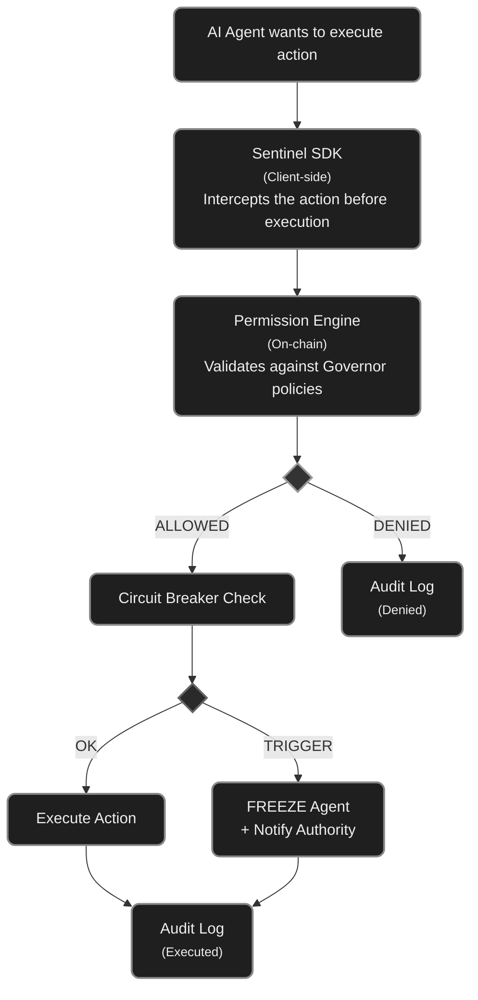
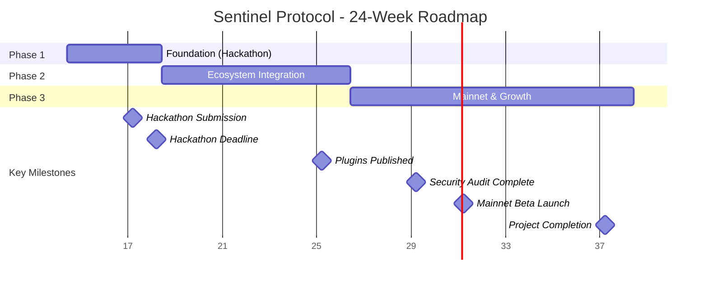

# Sentinel Protocol — Implementation Plan

## Overview

The Sentinel Protocol is an open-source governance protocol for autonomous AI agents on Solana. It standardizes how agents are controlled, constrained, and audited on-chain — functioning as the "Metaplex of agent governance."

This document details the technical architecture, development phases, technology stack, and milestones to take the project from concept to mainnet.

---

## 1. Technical Architecture

### 1.1 Core Protocol Components

The protocol consists of 4 on-chain Anchor programs and 1 off-chain SDK:

**Program 1: Governor Registry**  
Central registry of "Governors" — each Governor is a PDA (Program Derived Address) account that defines the governance rules for a specific agent. When a developer wants to govern an agent, they create a Governor linked to the agent’s public key.

Governor account fields:
- `authority` (Pubkey): who can modify the rules (owner, multisig, or DAO)
- `agent` (Pubkey): the public key of the governed agent
- `spending_policy` (SpendingPolicy): spending limits
- `allowed_protocols` (Vec<Pubkey>): program IDs the agent is allowed to interact with
- `allowed_tokens` (Vec<Pubkey>): allowed token mints
- `circuit_breaker` (CircuitBreakerConfig): emergency stop conditions
- `multisig_config` (Option<MultisigConfig>): multi-signature configuration
- `timelock_seconds` (u64): mandatory delay for policy changes
- `status` (GovernorStatus): Active, Paused, Frozen, Decommissioned
- `created_at` (i64): creation timestamp
- `updated_at` (i64): last update timestamp

**Program 2: Permission Engine**  
Permission engine that intercepts and validates agent actions against the policies defined in the Governor. It works as an on-chain middleware.

Main instructions:
- `validate_action(agent, action_type, target_program, amount, token)` → returns Allow/Deny
- `request_permission(agent, action_descriptor)` → for actions requiring approval
- `approve_permission(signer, request_id)` → multisig approval
- `batch_validate(agent, actions[])` → batch validation for efficiency

**Program 3: Circuit Breaker**  
Automatic emergency stop system.

Configurable parameters:
- `max_loss_percent` (u8): maximum allowed loss before freeze (e.g., 5%)
- `max_transactions_per_hour` (u32): transaction rate limit
- `max_single_transaction_amount` (u64): per-transaction cap
- `anomaly_detection_window` (u64): time window for detecting anomalous patterns
- `cooldown_period` (u64): cooldown period after trigger
- `auto_resume` (bool): whether the agent automatically resumes after cooldown

Instructions:
- `check_and_enforce(agent, proposed_action)` → checks against limits
- `trigger_emergency_stop(agent, reason)` → manual trigger by authority
- `resume_agent(agent)` → resumes operation (requires authority or cooldown)

**Program 4: Audit Log**  
Immutable on-chain record of all agent actions.

Each log entry contains:
- `agent` (Pubkey)
- `action_type` (enum: Transfer, Swap, Stake, GovernanceChange, etc.)
- `target_program` (Pubkey)
- `amount` (u64)
- `token` (Pubkey)
- `result` (enum: Allowed, Denied, CircuitBreakerTriggered)
- `timestamp` (i64)
- `tx_signature` (Hash)

Note: To optimize on-chain costs, detailed logs are stored off-chain (Arweave/Shadow Drive) with a verification hash on-chain.

**TypeScript/Python SDK: sentinel-sdk**  
Client-side library that abstracts the complexity of the on-chain programs.

```
sentinel-sdk/
├── src/
│   ├── governor.ts          # Governor creation and management
│   ├── permissions.ts       # Permission validation
│   ├── circuit-breaker.ts   # Circuit breaker configuration
│   ├── audit.ts             # Audit log querying
│   ├── multisig.ts          # Multi-signature operations
│   ├── plugins/
│   │   ├── elizaos.ts       # Plugin for ElizaOS
│   │   ├── goat.ts          # Plugin for GOAT Framework
│   │   └── zerepy.ts        # Plugin for ZerePy
│   └── utils/
│       ├── pda.ts           # PDA helpers
│       └── types.ts         # Shared types
├── python/
│   └── sentinel_sdk/        # Python bindings for ZerePy
└── examples/
    ├── basic-governor.ts
    ├── trading-bot-governance.ts
    └── dao-governed-agent.ts
```

### 1.2 Flow Diagram



### 1.3 Integration with Existing Ecosystem

- **Agent Registry (Solana Foundation):** Sentinel reads the agent’s identity from the Agent Registry. The Governor references the agent_id from the registry instead of reinventing identity.
- **SAID Protocol:** Sentinel can use SAID scores as input for policies (e.g., agents with reputation > 80 have higher limits).
- **ElizaOS:** Plugin that wraps the ElizaOS `execute()` with Sentinel validation before every on-chain action.
- **GOAT Framework:** Middleware that intercepts GOAT tool calls and validates them against the Governor.
- **x402 Protocol:** x402 payment validation against spending policies.

---

## 2. Technology Stack

### 2.1 On-chain (Solana Programs)

| Component          | Technology              | Justification                          |
|--------------------|-------------------------|----------------------------------------|
| Smart Contracts    | Anchor (Rust)           | Standard Solana framework, type-safety, automatic IDL |
| Testing            | Anchor Test (Mocha/TS)  | End-to-end integration tests           |
| Deployment         | Solana CLI + Anchor     | Devnet → Mainnet pipeline              |
| Off-chain Storage  | Shadow Drive or Arweave | Detailed logs with on-chain hash       |

### 2.2 SDK & Tooling

| Component       | Technology                  | Justification                          |
|-----------------|-----------------------------|----------------------------------------|
| Main SDK        | TypeScript                  | Solana ecosystem is TS-first           |
| Python SDK      | Python bindings (anchorpy)  | For ZerePy and Python agents           |
| CLI             | Node.js (Commander.js)      | Terminal-based governor management     |
| Dashboard       | React + Next.js             | Web interface for monitoring           |

### 2.3 Infrastructure

| Component      | Technology           | Justification                       |
|----------------|----------------------|-------------------------------------|
| CI/CD          | GitHub Actions       | Automated deploy and testing        |
| Monitoring     | Helius Webhooks      | Real-time action alerts             |
| Indexing       | Helius DAS API       | Fast querying of logs and states    |
| Documentation  | Docusaurus           | Developer-friendly docs             |

---

## 3. Development Phases

### PHASE 1: Foundation (Weeks 1-4) — For the Hackathon

**Objective:** Functional MVP on Devnet demonstrating the protocol core.

**Week 1: Setup & Governor Registry**
- Initialize Anchor project with monorepo structure
- Implement Governor Registry program (create, update, pause governors)
- Define data structs (SpendingPolicy, CircuitBreakerConfig, MultisigConfig)
- Unit tests for all instructions
- Deliverable: Governor can be created and configured on Devnet

**Week 2: Permission Engine & Circuit Breaker**
- Implement Permission Engine program (validate_action, request/approve_permission)
- Implement Circuit Breaker program (check_and_enforce, emergency_stop)
- Cross-program invocations (CPI) between Permission Engine ↔ Governor ↔ Circuit Breaker
- Integration tests: agent attempts action → allowed/blocked
- Deliverable: Complete validation flow working

**Week 3: TypeScript SDK Alpha + Audit Log**
- Implement Audit Log program (simplified on-chain logging)
- Create sentinel-sdk with classes: SentinelGovernor, PermissionValidator, CircuitBreaker
- Practical example: trading bot with spending limits and kill-switch
- Deliverable: SDK allows creating a governor and governing an agent in < 10 lines of code

**Week 4: Demo, Pitch & Polish**
- Create interactive demo: agent tries to overspend → circuit breaker activates
- Record demo video for the hackathon
- Minimal documentation (README, getting started)
- Refine pitch deck with real MVP data
- Deliverable: Complete hackathon submission

### PHASE 2: Ecosystem Integration (Weeks 5-12)

**Objective:** Integrate with existing agent frameworks and attract early users.

**Weeks 5-6: ElizaOS Plugin**
- Study ElizaOS plugin architecture
- Implement sentinel-elizaos-plugin that intercepts on-chain actions
- Tutorial: “How to add governance to your ElizaOS agent in 5 minutes”
- Publish on npm

**Weeks 7-8: GOAT Framework + ZerePy Plugin**
- Implement middleware for GOAT Framework (TypeScript)
- Implement Python bindings for ZerePy
- Integration tests with real agents
- Publish on npm and PyPI

**Weeks 9-10: Governance Dashboard**
- React/Next.js frontend for visualization
- Features: view active governors, audit logs, circuit breaker status
- Control panel: pause/resume agent, modify policies
- Wallet connection (Phantom/Backpack)

**Weeks 11-12: Audit & Security**
- Internal security review (fuzzing, edge-case testing)
- External audit (Sec3, OtterSec or Neodyme — apply for grants)
- Bug bounty program (limited, community-driven)
- Complete documentation on Docusaurus

### PHASE 3: Mainnet & Growth (Weeks 13-24)

**Objective:** Launch on mainnet, attract real agents, and establish the standard.

**Weeks 13-14: Mainnet Beta**
- Deploy programs to Mainnet-Beta
- Migration guide for Devnet users
- Monitoring & alerting via Helius Webhooks
- Rate limits and circuit breakers for the programs themselves

**Weeks 15-18: Community & Adoption**
- Grants Program: $5K–$10K for developers integrating Sentinel
- Workshops at Superteam BR and Solana communities
- List as a skill in Solana Foundation’s awesome-solana-ai
- Official SKILL.md submission for AI agents
- Partnerships with 3–5 active agent projects

**Weeks 19-22: Advanced Features**
- Advanced multi-sig with Squads Protocol integration
- Temporal spending policies (different limits by time/day)
- Agent scoring integration (SAID Protocol scores as input)
- Cross-program governance (govern agent across multiple protocols)
- Insurance pool v0: stakers deposit SOL to cover losses of governed agents

**Weeks 23-24: Token & Decentralization**
- Tokenomics design (governance token, staking for validators)
- Validator network: third parties audit agent behavior and earn fees
- DAO governance for the Sentinel protocol itself
- Whitepaper v1

### Gantt Chart


---

## 4. Repository Structure

```
sentinel-protocol/
├── programs/                    # Anchor Programs (Rust)
│   ├── governor-registry/
│   │   ├── src/
│   │   │   ├── lib.rs
│   │   │   ├── state.rs        # Account structs
│   │   │   ├── instructions/   # Instruction handlers
│   │   │   │   ├── create_governor.rs
│   │   │   │   ├── update_policy.rs
│   │   │   │   ├── pause_governor.rs
│   │   │   │   └── mod.rs
│   │   │   ├── errors.rs       # Custom errors
│   │   │   └── events.rs       # Events for indexing
│   │   └── Cargo.toml
│   ├── permission-engine/
│   │   └── src/
│   │       ├── lib.rs
│   │       ├── state.rs
│   │       ├── instructions/
│   │       │   ├── validate_action.rs
│   │       │   ├── request_permission.rs
│   │       │   └── approve_permission.rs
│   │       └── errors.rs
│   ├── circuit-breaker/
│   │   └── src/
│   │       ├── lib.rs
│   │       ├── state.rs
│   │       ├── instructions/
│   │       │   ├── check_and_enforce.rs
│   │       │   ├── trigger_emergency.rs
│   │       │   └── resume_agent.rs
│   │       └── errors.rs
│   └── audit-log/
│       └── src/
│           ├── lib.rs
│           ├── state.rs
│           └── instructions/
│               ├── log_action.rs
│               └── query_logs.rs
├── sdk/                         # TypeScript SDK
│   ├── src/
│   │   ├── index.ts
│   │   ├── governor.ts
│   │   ├── permissions.ts
│   │   ├── circuit-breaker.ts
│   │   ├── audit.ts
│   │   └── plugins/
│   │       ├── elizaos.ts
│   │       ├── goat.ts
│   │       └── zerepy.ts
│   ├── package.json
│   └── tsconfig.json
├── python-sdk/                  # Python SDK
│   ├── sentinel_sdk/
│   │   ├── __init__.py
│   │   ├── governor.py
│   │   └── permissions.py
│   └── pyproject.toml
├── app/                         # Dashboard (Next.js)
│   ├── src/
│   │   ├── app/
│   │   ├── components/
│   │   └── hooks/
│   └── package.json
├── cli/                         # CLI Tool
│   ├── src/
│   │   └── index.ts
│   └── package.json
├── tests/                       # Integration Tests
│   ├── governor-registry.ts
│   ├── permission-engine.ts
│   ├── circuit-breaker.ts
│   ├── full-flow.ts
│   └── stress-test.ts
├── docs/                        # Documentation
│   ├── getting-started.md
│   ├── architecture.md
│   ├── sdk-reference.md
│   └── integration-guides/
│       ├── elizaos.md
│       ├── goat.md
│       └── zerepy.md
├── examples/                    # Practical Examples
│   ├── basic-governor/
│   ├── trading-bot/
│   ├── dao-governed-agent/
│   └── x402-payments/
├── Anchor.toml
├── Cargo.toml
├── package.json
├── README.md
├── LICENSE                      # MIT
└── CONTRIBUTING.md
```

---

## 5. Success Metrics by Phase

### Phase 1 (Hackathon)
- Functional MVP on Devnet
- At least 1 end-to-end governed agent demo
- Hackathon submission accepted with demo video
- SDK allows creating governor in < 10 lines

### Phase 2 (Ecosystem)
- 3 plugins published (ElizaOS, GOAT, ZerePy)
- 10+ agents using Sentinel on Devnet
- Functional dashboard with real-time monitoring
- Security audit completed
- 50+ GitHub stars

### Phase 3 (Mainnet)
- Deployed on Mainnet-Beta
- 100+ governed agents
- $50K+ Total Value Governed (TVG)
- 3+ formal partnerships with agent projects
- Listed in official awesome-solana-ai
- $10K+ MRR from protocol fees

---

## 6. Technical Risks and Mitigations

### Risk: Added latency from governance middleware
**Mitigation:** Simple validations (spending limits, allowlists) are ultra-light on-chain (< 5ms). Complex validations use off-chain cache with periodic on-chain verification. The agent can operate in “optimistic mode” — execute first and verify later for low-risk actions.

### Risk: On-chain storage cost for audit logs
**Mitigation:** Hybrid model — log hash on-chain, full data on Shadow Drive/Arweave. Estimated cost: ~0.002 SOL per log entry on-chain (hash + minimal metadata only).

### Risk: Adoption depends on frameworks adopting the standard
**Mitigation:** Create zero-config plugins. The agent doesn’t need to change its code — the Sentinel plugin automatically wraps the calls. Contribute PRs directly to ElizaOS/GOAT repos.

### Risk: Smart contract vulnerabilities
**Mitigation:** Anchor framework reduces attack surface. External audit before mainnet. Bug bounty program. Upgradeable programs with 48h timelock for upgrades.

---

## 7. Estimated Budget (6 months)

| Item                              | Monthly Cost | Total 6 Months |
|-----------------------------------|--------------|----------------|
| 2 Solana/Rust Developers (full-time) | $8,000      | $48,000       |
| 1 Frontend/SDK Developer (full-time) | $4,000      | $24,000       |
| Infra (RPC, hosting, shadow drive)   | $500        | $3,000        |
| Security Audit (one-time)            | —           | $15,000       |
| Marketing / Developer Relations      | $1,000      | $6,000        |
| Legal / Compliance                   | —           | $4,000        |
| **Total**                            |              | **$100,000**  |

Note: Costs based on Brazil/LatAm rates. Hackathon prize + $500K seed round comfortably covers 12+ months of operation with buffer.

---

## 8. Hackathon Checklist (Immediate Priority)

- [ ] Initialize Anchor project (`anchor init sentinel-protocol`)
- [ ] Implement Governor Registry with create/update/pause
- [ ] Implement Permission Engine with validate_action
- [ ] Implement Circuit Breaker with check_and_enforce + emergency_stop
- [ ] Implement simplified Audit Log
- [ ] Create TypeScript sentinel-sdk with 3 main classes
- [ ] Write example: trading bot with spending limits
- [ ] Deploy to Devnet
- [ ] Integration tests passing
- [ ] README with getting started
- [ ] Record demo video (3-5 min)
- [ ] Finalize pitch deck with real MVP data
- [ ] Submit to Colosseum

---

## 9. References and Resources

- Solana Agent Registry: https://solana.com/agent-registry
- SAID Protocol: awesome-solana-ai (GitHub)
- ElizaOS: https://github.com/elizaos
- GOAT Framework: awesome-solana-ai
- Anchor Framework: https://www.anchor-lang.com/
- Squads Protocol (Multisig): https://squads.so/
- Solana Program Library (SPL Governance): https://github.com/solana-labs/solana-program-library
- aeamcp Registry Design: https://github.com/openSVM/aeamcp

---

*Document created in April 2026. Sentinel Protocol — Governing the future of the agent economy.*
